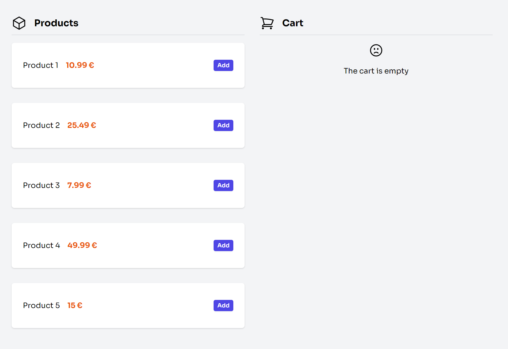
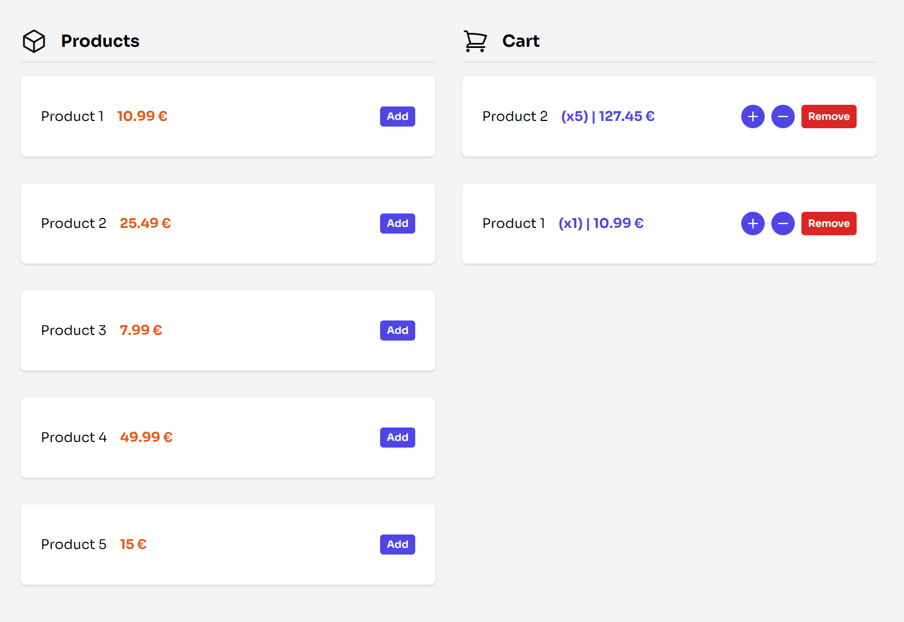

# Redux Toolkit Shopping Cart

Example of a shopping cart with products to learn and practice Redux Toolkit.




## Getting Started

To get started, first install all the project dependencies:

```
npm install
```

Then, you can start the development server by running the following command:

```
npm run dev
```

## Built With

- [Vite](https://vitejs.dev/)
- [React](https://es.react.dev/)
- [Redux Toolkit](https://redux-toolkit.js.org/)
- [TailwindCSS](https://tailwindcss.com/)

---

# Carrito de Compras con Redux Toolkit

Ejemplo de un carrito de compras con productos para aprender y practicar Redux Toolkit.


## Empezando

Para comenzar, primero instala todas las dependencias del proyecto:

```
npm install
```

Luego, puedes iniciar el servidor de desarrollo ejecutando el siguiente comando:

```
npm run dev
```

## Construido con

- [Vite](https://vitejs.dev/)
- [React](https://es.react.dev/)
- [Redux Toolkit](https://redux-toolkit.js.org/)
- [TailwindCSS](https://tailwindcss.com/)
